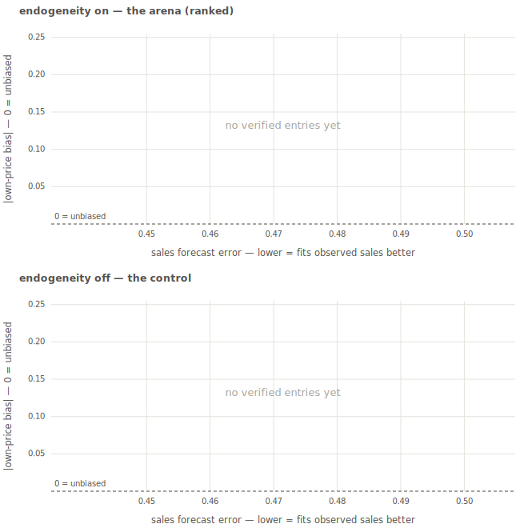
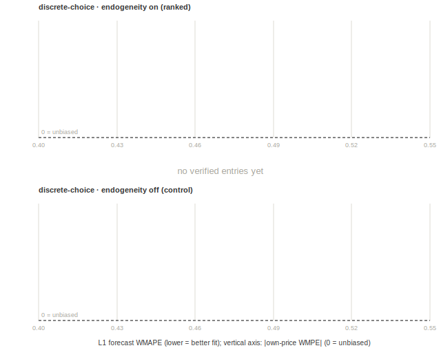

# CARD — Causal Recovery of Demand

**Can a model that fits observed demand well still recover causal price response, substitution, and counterfactual outcomes when prices and promotions are endogenous?**

This benchmark pairs synthetic retail scanner panels with a multimodal product surface (marketing-copy product descriptions that carry the true substitution geometry). Demand is simulated from a known data-generating process; prices and promotions respond to hidden demand shocks in half the cells, so estimators that ignore endogeneity fit the observed data well and still get the counterfactuals wrong. True elasticities and counterfactual outcomes are hidden and used only for scoring.

## The 2×2 grid

| Axis | Values |
|---|---|
| Demand family | **log-log** demand system (distance-disciplined cross-elasticities) / **structured random-coefficients discrete choice** (embedding-distance error covariance) |
| Endogeneity | **off** (control) / **on** (promotion *depth* responds to a hidden demand shock; cost-based instruments stay valid) |

Every cell is the full market: **40 products, 731 stores, 156 weeks** — 140 public training weeks plus 16 holdout-context weeks whose prices/promotions are public but whose sales are withheld. The two released instruments are `supply_cost_proxy` (primary) and `promo_cost` (secondary). Each product carries a `product_text` marketing-copy description (the substitution geometry's carrier). Store markets and brand codes are pseudonymized.

## Data

The data are hosted on Hugging Face: [`jean-jsj/CARD`](https://huggingface.co/datasets/jean-jsj/CARD).

The four cells are `complex_{log_log,covariance_probit}_{exogenous,endogenous}_seed001` (the `complex_` prefix is part of the frozen cell identifiers). Each cell directory contains:

- `public/` — everything your model may consume: `transactions_train_public.csv`, `transactions_holdout_context_public.csv`, `products_public.csv`, `stores_public.csv`, and `counterfactual_sweep_context_public.csv` (the 16 scored interventions). Markets and brand codes are pseudonymized.
- `hidden/` — **dev seed only**: the scoring truth (holdout sales, elasticity matrix, counterfactual Δq). Exists so you can score locally and instantly. **Data-access rule: `hidden/` is never model input.**
- `release/` — per-cell manifest (SHA-256 per file), release notes, datasheet.

**Dev / eval split.** Dev **seed 1** ships with scoring truth for offline iteration. Eval seeds ship public-only; their truth stays with the maintainer, who computes the leaderboard column (mean ± spread across eval seeds).

## Quickstart

```bash
git clone https://github.com/jean-jsj/CARD
cd CARD
pip install -e .                       # numpy + pandas only

python examples/download_data.py --cell complex_log_log_endogenous_seed001
python examples/quickstart.py --cell-dir benchmark/dev/complex_log_log_endogenous_seed001
```

`quickstart.py` builds a deliberately naive baseline submission from the public files and scores it — you should beat it easily. Submission file contracts: [`metrics/SUBMISSION_FORMAT.md`](metrics/SUBMISSION_FORMAT.md).

## What is scored

| Layer | Question | Metric |
|---|---|---|
| **1 — demand** | Do you forecast held-out sales? | revenue-weighted WMAPE / WMPE |
| **2 — elasticities** | Do you recover the J×J price-response matrix? | sign accuracy, F1, NDCG, WMAPE/WMPE |
| **3 — counterfactuals (headline)** | Do you predict Δq under a +10% price move? | signed **own-price WMPE** + unsigned **substitution WAPE** |
| **4 — validity (actual arm)** | Are your real-data predictions causally coherent? | label-free sign/band/monotonicity checks |

The headline is Layer 3, read off one flagship scenario: the leaderboard ranks by |own-price WMPE| (identification bias, 0 = unbiased), with substitution WAPE alongside (competitor-redistribution error; predicting "no change" scores the full mass). Both are category-netted so a category-wide shift can't masquerade as substitution. The interesting comparison is *endogeneity-on vs -off*: a purely predictive model can win Layer 1 and still fail Layer 3 in the endogeneity-on cells.

The benchmark also runs an **actual-data arm** (Layer 1 + Layer 4) on a real point-of-sale panel: the **Dominick's Finer Foods** scanner data published by the [Kilts Center for Marketing](https://www.chicagobooth.edu/research/kilts/research-data/dominicks) (Chicago Booth), **Bathroom Tissues** category — the closest real analog to the synthetic facial-tissue category. The data are free for academic research (attribution to the Kilts Center required) and are not redistributed here: download the category files from the Kilts Center and point `--actual-data-root` at them; the loader ([`metrics/actual_data.py`](metrics/actual_data.py)) is deterministic, so every participant reconstructs the identical panel. Real data has no counterfactual truth, so Layers 2–3 are synthetic-arm only — and because the Dominick's files are public, the actual-arm Layer 1 is an honor-system diagnostic rather than an adversarially-hidden target.

## Leaderboard

Entries are ranked by **|own-price WMPE|** in each family's endogeneity-on cell (0 = unbiased; the sign stays visible for direction). The two family columns rank independently — the same entry can hold different ranks in each. L1 forecast WMAPE is reported alongside and never enters the rank: the benchmark's point is that the two can diverge. The plots pair each arena cell with its endogeneity-off control.





<!-- LEADERBOARD:START -->
| Model | log-log own WMPE (rank) | L1 WMAPE | discrete-choice own WMPE (rank) | L1 WMAPE |
|---|---|---|---|---|
| *no verified entries yet* | | | | |
<!-- LEADERBOARD:END -->

The four reference models (instruments × text grid) are not leaderboard entries; their results are reported in the paper, their per-cell scores live in [`submissions/`](submissions/) (`reference_*`), and their predictions are hosted with the dataset (`reference/` on Hugging Face).

To submit an entry, see [CONTRIBUTING.md](CONTRIBUTING.md): score locally on the dev seed, then open a PR with your predictions; the maintainer scores the eval seeds and regenerates this leaderboard (`python scripts/make_leaderboard.py`).

## The generator is withheld — verifiably

The DGP code and calibrated parameters are not published while the evaluation phase runs (publishing them would let anyone regenerate the hidden truth). The construction is documented at the equation level in the paper appendix, and a SHA-256 commitment to the exact frozen generator source is published in [`GENERATOR_COMMITMENT.md`](GENERATOR_COMMITMENT.md); the archive will be released to match that hash after the evaluation phase.

## Repository layout

| Path | What |
|---|---|
| [`causal_demand_metrics/`](causal_demand_metrics/README.md) | Scoring math (pip-installable; numpy + pandas only). |
| [`metrics/`](metrics/README.md) | Scoring harness: `evaluate_submission`, `evaluate_all`, `leaderboard`, `diagnostics`. |
| [`examples/`](examples/) | Data download + naive-baseline quickstart. |
| [`submissions/`](submissions/) | Reference-model entries and scores; verified leaderboard entries land here by PR. |
| [`DATASHEET.md`](DATASHEET.md) | Datasheet for the dataset (Gebru et al. format). |
| `tests/` | Test suite (self-contained; no data download needed). |

## License & citation

Code: **Apache-2.0** ([LICENSE](LICENSE)). Data: **CC BY 4.0** (declared on the Hugging Face dataset card). The panels are synthetic, calibrated to moments of the IRI academic scanner dataset; no real transactions are included.

```bibtex
@misc{hong2026card,
  author    = {Hong, Juwon and Hwang, Minha and Shankar, Venkatesh},
  title     = {CARD: Causal Recovery of Demand},
  year      = {2026},
  doi       = {10.57967/hf/9681},
  publisher = {Hugging Face},
  url       = {https://huggingface.co/datasets/jean-jsj/CARD}
}
```

(Also in [CITATION.cff](CITATION.cff); the paper reference will replace this upon publication.)
